# 🔐 SteganoVault - Secure Steganography Tool

<div align="center">

**Hide secrets in plain sight. Encode messages in images, documents, audio, and video files.**

[](https://www.docker.com/)
[](https://flask.palletsprojects.com/)
[](https://www.mysql.com/)
[](https://nginx.org/)
[](https://www.python.org/)
[](LICENSE)

[Features](#-features) • [Tech Stack](#-technology-stack) • [Quick Start](#-quick-start) • [Architecture](#-architecture) • [API](#-api-endpoints) • [Screenshots](#-screenshots)

</div>

---

## 📖 Overview

**SteganoVault** is a powerful, production-ready steganography application that lets you hide secret messages inside ordinary files — images, text documents, PDFs, DOCX files, audio, and video. Built with a modern **microservices architecture** using **Docker Compose**, it combines the flexibility of **Flask** with the reliability of **MySQL** and the performance of **Nginx** as a reverse proxy.

Whether you're a security enthusiast, a developer learning Docker, or someone curious about steganography, SteganoVault provides an intuitive, feature-rich platform for covert communication.

---

## 📚 Documentation

This project has **five comprehensive documentation files**. Each covers a specific aspect — from beginner setup to architectural deep dives.

| Document | Description | Best For |
|----------|-------------|----------|
| 📘 **[USER_GUIDE.md](USER_GUIDE.md)** | Complete end-to-end setup guide from scratch. Covers Docker installation, environment configuration, testing features, troubleshooting, and cleanup. | **Beginners** — first-time setup |
| 🏗️ **[ARCHITECTURE.md](ARCHITECTURE.md)** | Deep dive into system design, design decisions, trade-offs, scalability roadmap, and lessons learned. | **Senior devs** — understanding design |
| 🔄 **[WORKFLOW.md](WORKFLOW.md)** | Complete container workflow — startup sequence, request lifecycle (encode/decode), database flow, and file processing pipeline. | **Anyone** — how it all connects |
| 🐛 **[ISSUES.md](ISSUES.md)** | Real issues faced during development and deployment, with root cause analysis and fixes. 10 documented problems. | **Debugging** — common pitfalls |
| 💼 **[INTERVIEW_QA.md](INTERVIEW_QA.md)** | 40+ interview questions and answers based on this project. Covers Docker, Flask, MySQL, Nginx, and System Design. | **Interview prep** — tech discussions |

### 🎯 Quick Navigation

**New to the project?** Start here → [USER_GUIDE.md](USER_GUIDE.md)

**Want to understand the design?** → [ARCHITECTURE.md](ARCHITECTURE.md)

**Hitting an error?** → [ISSUES.md](ISSUES.md)

**Preparing for interviews?** → [INTERVIEW_QA.md](INTERVIEW_QA.md)

**Curious how data flows?** → [WORKFLOW.md](WORKFLOW.md)

---

## ✨ Features

### 🎯 Core Functionality
- **Multi-format Support** — Hide messages in:
  - 🖼️ Images (PNG, JPG, JPEG)
  - 📄 Text Files (TXT)
  - 📑 PDF Documents
  - 📝 Word Documents (DOCX)
  - 🎵 Audio (MP3, WAV)
  - 🎥 Video (MP4, AVI, MOV)
- **Password Protection** — Optional BCrypt-hashed password layer
- **Real-time Processing** — Files processed in-memory and auto-deleted
- **Checksum Verification** — SHA-256 integrity check for encoded files
- **Google Drive Integration** — Optional shareable link generation

### 🎨 User Experience
- **11 Stunning Themes** — Dark, Light, Cyberpunk, Retro Spy, Neon Noir, Vaporwave, Steampunk, Hacker Terminal, Cosmic Galaxy, Minimal Zen, Glitchcore
- **Interactive Tutorial** — Step-by-step guide for new users
- **Gamification** — Stealth Score system with unlockable badges (Rookie Spy, Codebreaker, Shadow Agent)
- **Spy Target Practice** — Mini-game to boost your score
- **Live Preview** — Before/After previews for images
- **Responsive Design** — Optimized for mobile, tablet, and desktop

### 🔒 Security Features
- **Email OTP Verification** — Secure account activation
- **BCrypt Password Hashing** — Industry-standard security
- **Session Management** — Flask secure sessions
- **SQL Injection Protection** — Parameterized MySQL queries
- **Security Headers** — XSS, Clickjacking, MIME-sniffing protection
- **Password Reset Flow** — OTP-based recovery

### 👥 Community Features
- **User Reviews** — Star-rated feedback system
- **Testimonials Carousel** — Auto-rotating verified reviews
- **Contact Form** — Direct EmailJS integration

### 🐳 DevOps Features
- **Multi-container Docker Compose** — Flask + MySQL + Nginx + phpMyAdmin
- **Health Checks** — All services monitored
- **Auto-initializing Database** — SQL schema mounted as volume
- **Nginx Reverse Proxy** — Gzip compression, caching, rate limiting
- **phpMyAdmin** — Browser-based database management
- **Environment-based Config** — `.env` file for secrets

---

## 🛠 Technology Stack

### Backend
| Component | Purpose |
|-----------|---------|
| **Python 3.10** | Core language |
| **Flask 2.3** | Web framework |
| **Gunicorn** | WSGI HTTP server |
| **MySQL 8.0** | Primary database |
| **MySQL Connector** | Python-MySQL bridge with pooling |
| **BCrypt** | Password hashing |
| **Flask-Mail** | Email service |
| **Stegano** | LSB steganography |
| **PyPDF2** | PDF manipulation |
| **python-docx** | DOCX manipulation |
| **Pydub** | Audio processing |
| **OpenCV** | Video processing |
| **Mutagen** | Video metadata |
| **Pillow** | Image processing |

### Frontend
| Component | Purpose |
|-----------|---------|
| **HTML5** | Structure |
| **CSS3** | Styling (custom themes) |
| **JavaScript (ES6+)** | Interactivity |
| **Tailwind CSS** | Utility-first framework |
| **Font Awesome** | Icons |
| **Motion One** | Animations |
| **EmailJS** | Client-side email |

### DevOps & Infrastructure
| Component | Purpose |
|-----------|---------|
| **Docker** | Containerization |
| **Docker Compose** | Multi-container orchestration |
| **Nginx** | Reverse proxy + static serving |
| **phpMyAdmin** | Database admin UI |
| **MySQL Volume** | Persistent data storage |

---

## 📸 Screenshots

### 🖥️ User Interface

#### Main Interface
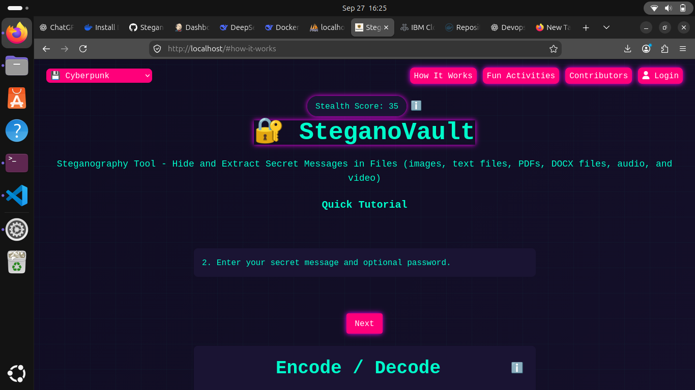
*Clean, modern interface with all tools in one place*

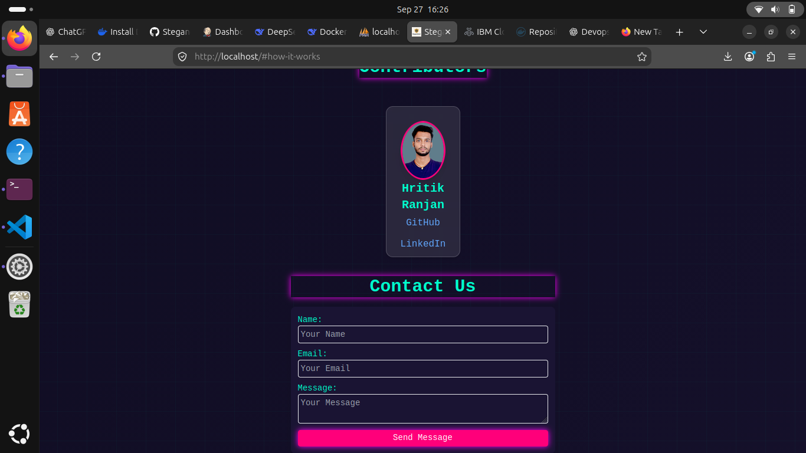
*Responsive layout across different screen sizes*

### 🎨 Themes Gallery

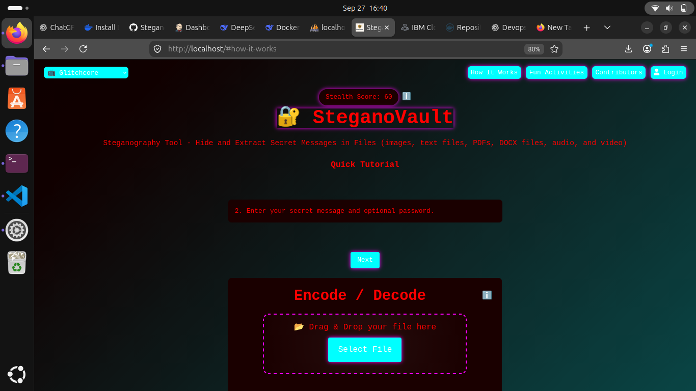
*Cyberpunk theme with neon grid and glow effects*

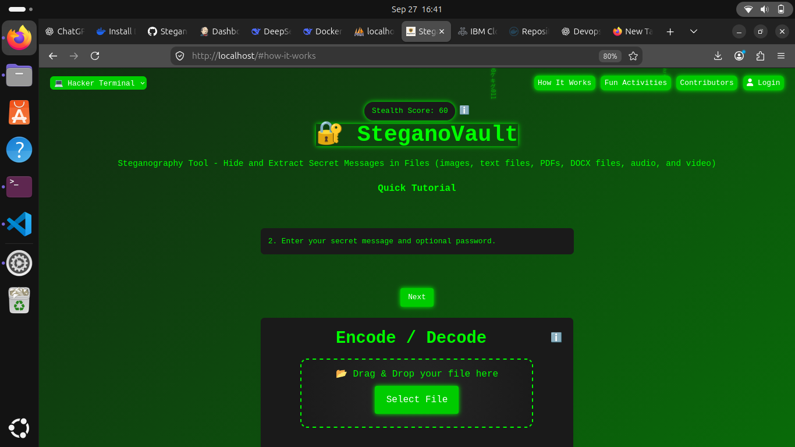
*Hacker Terminal with Matrix-style code rain*

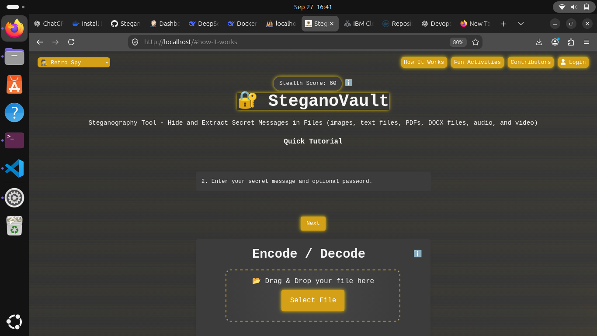
*Cosmic Galaxy with twinkling stars*

### 🔐 Encoding & Decoding

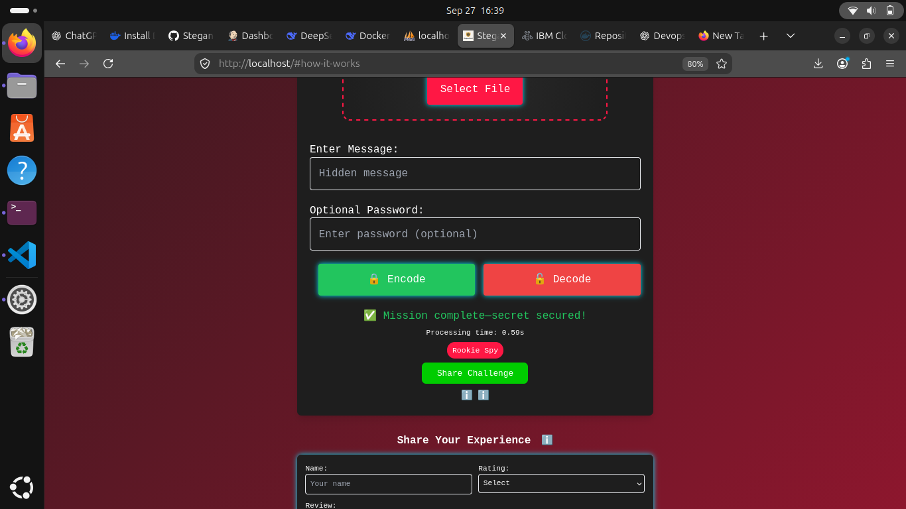
*Encoding a secret message into an image*

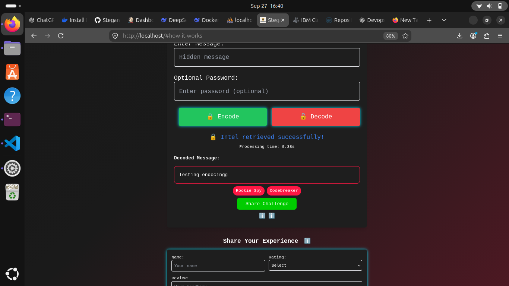
*Successfully decoded message display*

### 🗄️ Database Management

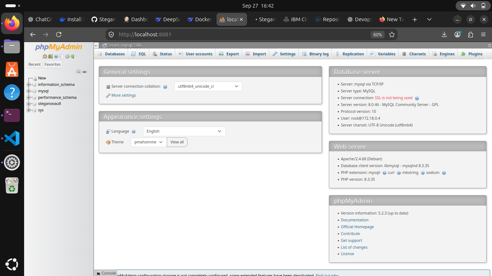
*phpMyAdmin login interface*

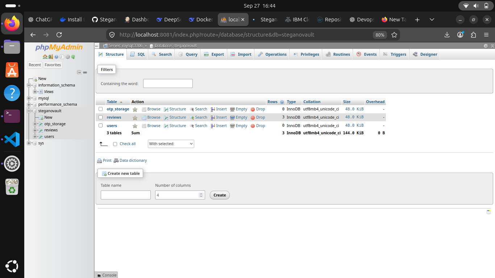
*MySQL tables: users, otp_storage, reviews*

### ❤️ Health Checks

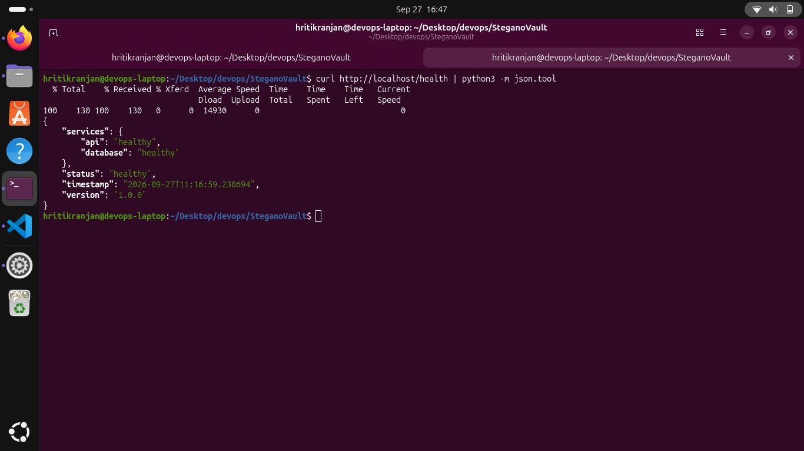
*Application health endpoint response*

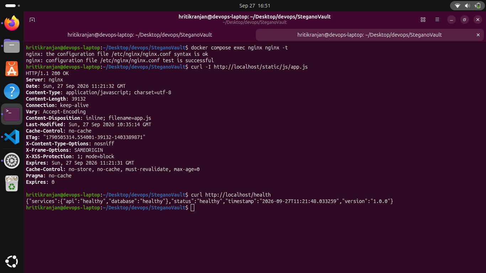
*All services showing healthy status*

### 🐳 Docker Infrastructure

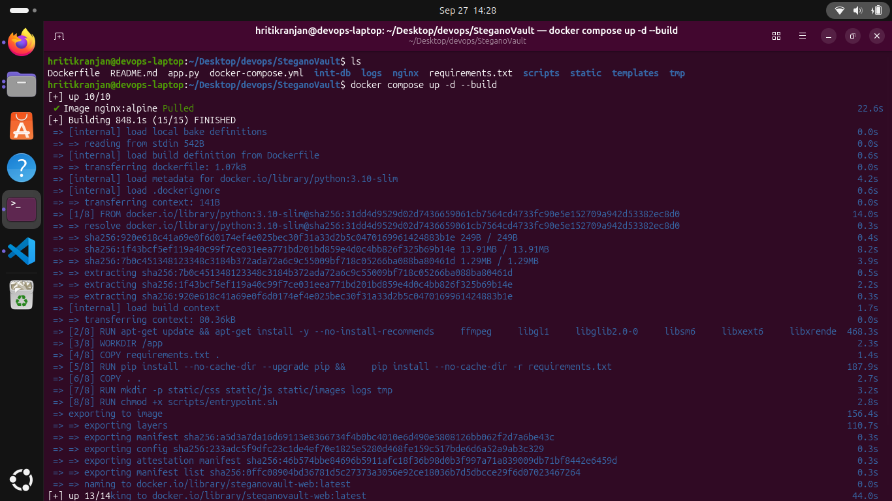
*Building and starting all containers*

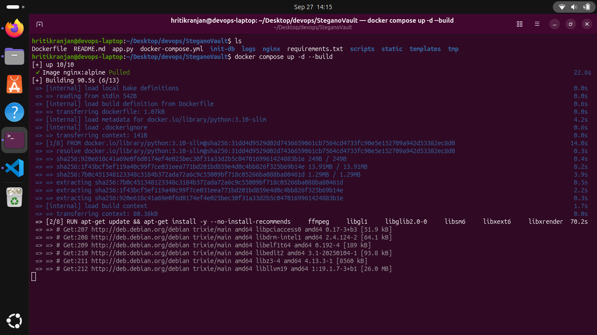
*Full stack deployment progress*

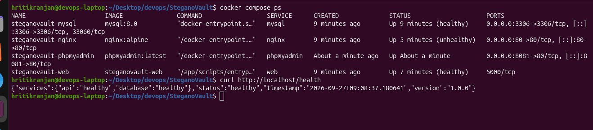
*All 4 containers running with health checks*

### 🐛 Issue Tracking & Resolution

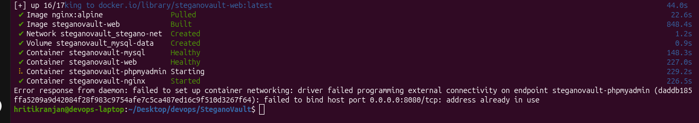
*Initial issue encountered during deployment*

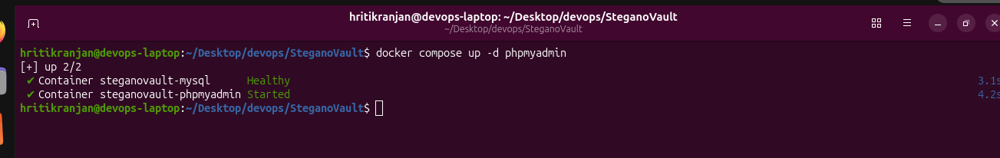
*Issue 1 successfully resolved*

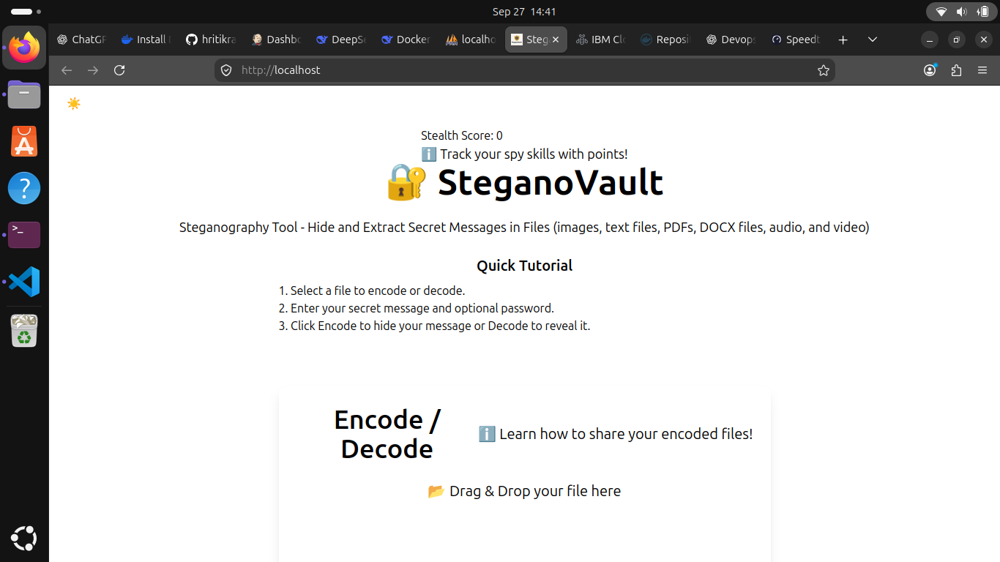
*Secondary issue during configuration*

### ✅ Final Verification

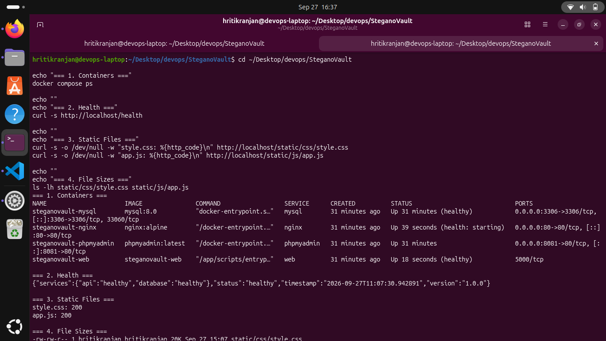
*Everything working — full stack operational*

---

## 🏗 Architecture

### System Diagram

```
┌─────────────────────────────────────────────────────────────┐
│                       CLIENT (Browser)                        │
└─────────────────────────────────────────────────────────────┘
                              │
                              ▼ HTTP :80
┌─────────────────────────────────────────────────────────────┐
│                    NGINX Reverse Proxy                        │
│  • Serves static files                                        │
│  • Gzip compression                                           │
│  • Rate limiting                                              │
│  • Client body size: 100M                                     │
└─────────────────────────────────────────────────────────────┘
                              │
                              ▼ HTTP :5000
┌─────────────────────────────────────────────────────────────┐
│                    Flask Application                          │
│  • Gunicorn (2 workers, 2 threads)                           │
│  • REST API endpoints                                         │
│  • Steganography engine                                       │
│  • Authentication logic                                       │
└─────────────────────────────────────────────────────────────┘
                              │
                              ▼ MySQL :3306
┌─────────────────────────────────────────────────────────────┐
│                      MySQL 8.0 Database                       │
│  • users table                                                │
│  • otp_storage table                                          │
│  • reviews table                                              │
└─────────────────────────────────────────────────────────────┘
                              ▲
                              │
┌─────────────────────────────────────────────────────────────┐
│                    phpMyAdmin (Admin UI)                      │
│  • Browser-based DB management                                │
│  • Exposed on port 8081                                       │
└─────────────────────────────────────────────────────────────┘
```

> 📖 **For detailed architecture** — see [ARCHITECTURE.md](ARCHITECTURE.md)

### Container Overview

| Container | Image | Port | Purpose |
|-----------|-------|------|---------|
| `steganovault-web` | Custom (Dockerfile) | 5000 (internal) | Flask app with Gunicorn |
| `steganovault-mysql` | `mysql:8.0` | 3306 | Database |
| `steganovault-nginx` | `nginx:alpine` | 80 | Reverse proxy |
| `steganovault-phpmyadmin` | `phpmyadmin:latest` | 8081 | DB admin UI |

> 📖 **For complete workflow** — see [WORKFLOW.md](WORKFLOW.md)

---

## 🚀 Quick Start

### Prerequisites

- **Docker** 20.10+ ([Install](https://docs.docker.com/get-docker/))
- **Docker Compose** v2+ (usually bundled with Docker)
- **Git** ([Install](https://git-scm.com/))

> 📖 **For detailed setup instructions** — see [USER_GUIDE.md](USER_GUIDE.md)

### Step 1: Clone the Repository

```bash
git clone https://github.com/hritikranjan1/SteganoVault-Docker.git
cd SteganoVault-Docker
```

### Step 2: Configure Environment

```bash
cp .env.example .env
nano .env  # Edit with your credentials
```

**Minimal `.env` (works out of the box):**

```env
# Flask
SECRET_KEY=change-this-to-a-random-string
FLASK_ENV=production

# MySQL
MYSQL_ROOT_PASSWORD=rootpassword123
MYSQL_DATABASE=steganovault
MYSQL_USER=stegano
MYSQL_PASSWORD=stegano123

# Optional: Email (for OTP)
MAIL_SERVER=smtp-relay.brevo.com
MAIL_PORT=587
MAIL_USE_TLS=true
MAIL_USERNAME=your-email@example.com
MAIL_PASSWORD=your-smtp-password
MAIL_DEFAULT_SENDER=noreply@steganovault.com

# Optional: Google Drive
GOOGLE_DRIVE_FOLDER_ID=
GOOGLE_CREDENTIALS=
```

### Step 3: Launch the Stack

```bash
docker compose up -d --build
```

**First-time build takes 8-15 minutes** (installing system dependencies). Subsequent builds are cached and take ~30 seconds.

### Step 4: Verify Everything Is Running

```bash
docker compose ps
```

**Expected output:**

```
NAME                       STATUS
steganovault-mysql         Up (healthy)
steganovault-nginx         Up (healthy)
steganovault-phpmyadmin    Up
steganovault-web           Up (healthy)
```

### Step 5: Access the Application

| Service | URL | Credentials |
|---------|-----|-------------|
| 🌐 **Main App** | [http://localhost](http://localhost) | — |
| 🗄️ **phpMyAdmin** | [http://localhost:8081](http://localhost:8081) | `root` / `rootpassword123` |
| ❤️ **Health Check** | [http://localhost/health](http://localhost/health) | — |
| 🐬 **MySQL (CLI)** | `localhost:3306` | `stegano` / `stegano123` |

---

## 📁 Project Structure

```
SteganoVault/
├── app.py                      # Flask application
├── requirements.txt            # Python dependencies
├── Dockerfile                  # Container build
├── docker-compose.yml          # Multi-container orchestration
├── .env.example                # Environment template
├── .dockerignore               # Docker build exclusions
├── .gitignore                  # Git exclusions
├── LICENSE                     # MIT License
├── README.md                   # This file
│
├── USER_GUIDE.md               # 📘 Beginner setup guide
├── ARCHITECTURE.md             # 🏗️ System design deep dive
├── WORKFLOW.md                 # 🔄 Complete workflow documentation
├── ISSUES.md                   # 🐛 Problems and solutions log
├── INTERVIEW_QA.md             # 💼 Interview preparation guide
│
├── init-db/
│   └── init.sql                # Auto-run schema + seed data
│
├── nginx/
│   ├── nginx.conf              # Main Nginx config
│   └── conf.d/
│       └── default.conf        # Server block
│
├── scripts/
│   └── entrypoint.sh           # Container startup script
│
├── templates/
│   └── index.html              # Main HTML template
│
├── static/
│   ├── css/
│   │   ├── style.css           # Custom themes & styles
│   │   └── tailwind.min.css    # Tailwind CSS (local)
│   ├── js/
│   │   └── app.js              # All application JavaScript
│   └── screenshots/            # README images
│
├── logs/                       # Application logs
└── tmp/                        # Temporary processing files
```

---

## 🔌 API Endpoints

### Authentication

| Method | Endpoint | Description |
|--------|----------|-------------|
| `POST` | `/auth/register` | Register new user (sends OTP) |
| `POST` | `/auth/verify` | Verify OTP |
| `POST` | `/auth/login` | User login |
| `POST` | `/auth/logout` | User logout |
| `GET` | `/auth/status` | Check auth status |
| `POST` | `/auth/forgot-password` | Request reset OTP |
| `POST` | `/auth/reset-password` | Reset password with OTP |

### File Processing

| Method | Endpoint | Description |
|--------|----------|-------------|
| `POST` | `/encode` | Encode message in file |
| `POST` | `/decode` | Decode message from file |

### Community

| Method | Endpoint | Description |
|--------|----------|-------------|
| `GET` | `/api/reviews` | Fetch all verified reviews |
| `POST` | `/api/reviews` | Submit a new review (auth required) |
| `GET` | `/api/reviews/latest` | Latest 10 reviews |
| `GET` | `/api/testimonials` | Default + verified testimonials |

### System

| Method | Endpoint | Description |
|--------|----------|-------------|
| `GET` | `/health` | Health check for all services |
| `GET` | `/privacy` | Privacy policy |
| `GET` | `/` | Main application |

---

## 🎯 Usage Guide

### Encoding a Secret Message

1. Open **http://localhost**
2. **Drag & drop** or click **Select File** to upload your carrier file
3. Enter your **secret message**
4. (Optional) Add a **password** for extra security
5. Click **🔒 Encode**
6. The encoded file downloads automatically

> 💡 **Tip:** Use a high-quality image (PNG recommended) for best results.

### Decoding a Secret Message

1. Upload the encoded file
2. Enter the password (if one was used)
3. Click **🔓 Decode**
4. The hidden message appears below

### Sharing Encoded Files

⚠️ **Important:** Share encoded files via:
- ✅ **Google Drive** (preserves file integrity)
- ✅ **Email attachment**
- ✅ **Direct file transfer**

❌ **Avoid:** WhatsApp, Telegram, or any compression-based service — they may strip hidden data.

If a password was used, share it **separately** (via secure chat).

> 📖 **For step-by-step testing** — see [USER_GUIDE.md](USER_GUIDE.md)

---

## 🎨 Theme System

SteganoVault includes **11 handcrafted themes**:

| Theme | Style | Special Effect |
|-------|-------|----------------|
| 🌙 Dark | Classic dark | Gradient motion |
| ☀️ Light | Clean white | Gradient motion |
| 💾 Cyberpunk | Neon aesthetic | Animated grid |
| 🕵️ Retro Spy | Vintage | Scanlines |
| 🌌 Neon Noir | Noir style | Floating particles |
| 📼 Vaporwave | 80s aesthetic | Wave animation |
| ⚙️ Steampunk | Industrial | Gradient motion |
| 💻 Hacker Terminal | Matrix | Code rain |
| 🌠 Cosmic Galaxy | Space | Twinkling stars |
| 🧘 Minimal Zen | Simple | Gradient motion |
| 📺 Glitchcore | Glitch art | Glitch effect |

Change themes from the dropdown in the top-left corner.

---

## 🐳 Docker Commands Cheatsheet

```bash
# Start all services
docker compose up -d

# Start with rebuild
docker compose up -d --build

# Stop all services
docker compose down

# Stop AND delete all data
docker compose down -v

# Restart a specific service
docker compose restart web
docker compose restart nginx

# View live logs
docker compose logs -f
docker compose logs -f web

# Access container shell
docker compose exec web bash
docker compose exec mysql bash

# Connect to MySQL CLI
docker compose exec mysql mysql -u stegano -pstegano123 steganovault

# Check container health
docker compose ps

# View resource usage
docker stats --no-stream

# Full cleanup
docker system prune -a
```

---

## 🔧 Troubleshooting

### Port Already in Use

**Error:** `failed to bind host port 0.0.0.0:80/tcp: address already in use`

**Fix:**
```bash
# Find what's using port 80
sudo lsof -i :80

# Either stop that service, or change SteganoVault's port:
# Edit docker-compose.yml → nginx → ports → "8080:80"
# Then access via http://localhost:8080
```

### Frontend Not Loading (Cache Issue)

**Fix 1 — Hard refresh:**
```
Ctrl + Shift + R (Windows/Linux)
Cmd + Shift + R (Mac)
```

**Fix 2 — Disable cache in DevTools:**
1. F12 → Network tab
2. ✅ Check **Disable Cache**
3. Refresh page

**Fix 3 — Incognito mode:**
- `Ctrl + Shift + N` (Chrome)
- `Ctrl + Shift + P` (Firefox)

### Nginx 502 Bad Gateway

```bash
# Check if web container is healthy
docker compose ps web

# Wait for it to become healthy (60s startup period)
# Then retry
```

> 📖 **For more troubleshooting** — see [ISSUES.md](ISSUES.md)

---

## 🔒 Security Considerations

### What SteganoVault Does ✅
- ✅ Processes files in-memory
- ✅ Deletes temp files immediately after processing
- ✅ Hashes passwords with BCrypt
- ✅ Uses parameterized SQL queries
- ✅ Sets security headers
- ✅ Validates file uploads

### What SteganoVault Does NOT Do ⚠️
- ❌ True encryption (steganography ≠ encryption)
- ❌ Long-term secure storage
- ❌ Protection against determined steganalysis

> **Disclaimer:** This tool is for **educational and entertainment purposes**. Do not use for sensitive/confidential data. For serious security, use proper encryption tools like GPG, VeraCrypt, or Signal.

---

## ⚡ Performance

| Operation | Average Time |
|-----------|--------------|
| Image encode (1 MB) | ~0.3s |
| Image decode (1 MB) | ~0.2s |
| PDF encode (100 KB) | ~0.5s |
| DOCX encode (50 KB) | ~0.4s |
| Audio encode (5 MB WAV) | ~2.5s |
| Video encode (10 MB MP4) | ~1.5s |

**Container resource limits:**
- Web: 2 CPU, 2 GB RAM
- MySQL: default
- Nginx: minimal
- phpMyAdmin: minimal

---

## 🤝 Contributing

Contributions are welcome! Here's how:

1. **Fork** the repository
2. **Create** a feature branch
   ```bash
   git checkout -b feature/amazing-feature
   ```
3. **Commit** your changes
   ```bash
   git commit -m "feat: add amazing feature"
   ```
4. **Push** to the branch
   ```bash
   git push origin feature/amazing-feature
   ```
5. **Open** a Pull Request

### Commit Convention
- `feat:` — New feature
- `fix:` — Bug fix
- `docs:` — Documentation
- `refactor:` — Code refactor
- `chore:` — Maintenance

---

## 📄 License

This project is licensed under the **MIT License** — see the [LICENSE](LICENSE) file for details.

---

## 🙏 Acknowledgments

- [Stegano](https://github.com/cedricbonhomme/Stegano) — LSB steganography library
- [Flask](https://flask.palletsprojects.com/) — Web framework
- [Docker](https://www.docker.com/) — Containerization
- [Tailwind CSS](https://tailwindcss.com/) — Utility-first CSS
- [Font Awesome](https://fontawesome.com/) — Icons

---

## 📞 Contact

**Hritik Ranjan**

- 🐙 GitHub: [@hritikranjan1](https://github.com/hritikranjan1)
- 💼 LinkedIn: [hritikranjan1](https://www.linkedin.com/in/hritikranjan1/)

---

<div align="center">

### ⭐ If you found this project useful, please give it a star! ⭐

**Built with ❤️ using Flask, Docker, MySQL, and Nginx**

📘 [User Guide](USER_GUIDE.md) • 🏗️ [Architecture](ARCHITECTURE.md) • 🔄 [Workflow](WORKFLOW.md) • 🐛 [Issues](ISSUES.md) • 💼 [Interview Q&A](INTERVIEW_QA.md)

</div>
